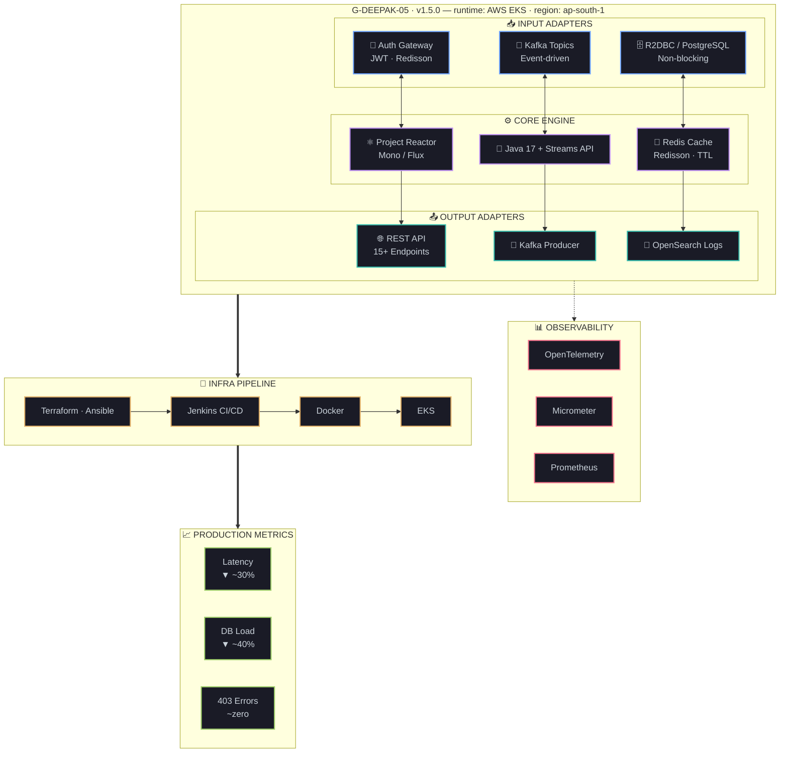

<!--
  G-Deepak-05 / G-Deepak-05
  ─────────────────────────────────────────────────────
  Hacker/terminal aesthetic. No badge walls.
  Snake · WIP · Wakatime · Featured repos · Full system diagram.
-->

<div align="center">


<br/>

[](https://linkedin.com/in/gdeepak-ase)
[](mailto:gdepakise2025@gmail.com)
[](https://github.com/G-Deepak-05)

<br/>


</div>

<br/>

---

<table width="100%"><tr>
<td width="58%" valign="top">

### `$ whoami`

Backend engineer obsessed with **latency, observability, and systems that don't break at 3AM.**

1.5 years shipping production microservices at scale — reactive APIs, distributed tracing, event-driven architecture.

- ⚡ Cut p99 response times **~30%** via non-blocking reactive pipelines
- 🗄️ Reduced DB load **~40%** with Redis (Redisson) JWT caching
- 🔍 Drove production 403 errors to **~zero** with OpenTelemetry + OpenSearch
- 🌍 Currently deepening into **Go · gRPC · Raft · CQRS**

📍 Bengaluru, India

</td>
<td width="42%" valign="top">

```java
class Deepak implements BackendEngineer {

  String[] stack = {
    "Java 17",      "Spring WebFlux",
    "Kafka",        "Redis (Redisson)",
    "Docker",       "Kubernetes (EKS)",
    "Terraform",    "OpenTelemetry"
  };

  String location  = "Bengaluru 🇮🇳";
  String learning  = "Go + gRPC";
  String motto     = "Trace everything.";
}
```

</td>
</tr></table>

---

## ◈ Tech Radar — `skillicons --render`

<div align="center">


</div>

---

## ◈ Currently Building — `tail -f /var/log/deepak/wip.log`

```
[2025-09-xx] [INFO]  spawning goroutines... learning Go internals
[2025-09-xx] [INFO]  protobuf schemas defined · gRPC server skeleton up
[2025-09-xx] [INFO]  reading: Raft consensus paper (Ongaro & Ousterhout)
[2025-09-xx] [INFO]  exploring: Event Sourcing + CQRS patterns
[2025-09-xx] [INFO]  target: distributed KV store in Go  ← WIP
[2025-09-xx] [WARN]  sleep() not called in 48h — feature, not a bug
```

> **Next milestone:** gRPC service with bidirectional streaming, deployed on EKS — eta unknown, ETA always lies.

---

## ◈ Architecture — `deepak.service`

> *I think in systems. Here's mine.*



---

## ◈ Career — `git log --oneline`

```
HEAD  wip:  learning Go · gRPC · Raft · Event Sourcing · CQRS

●  Backend Engineer — Tejmonvi → Sportstech GmbH            [Sep 2025 – present]
   ├─ Built 15+ Spring WebFlux APIs; ~30% latency improvement
   ├─ Redis (Redisson) JWT caching → ~40% DB load reduction
   ├─ Zero prod 403s via OpenTelemetry distributed tracing + OpenSearch
   └─ Docker + EKS + Jenkins across dev / staging / prod

●  4× Oracle Cloud Certifications                           [Jun – Sep 2025]
   └─ Data Science Pro · Architect Associate · AI Foundations · Foundations

●  AWS Cloud Engineer — Cravita Technologies                [Mar 2025]
   ├─ CI/CD: CodePipeline + CodeDeploy + Jenkins
   ├─ IaC: Terraform + Ansible across 3 environments
   └─ 3-tier AWS stack: ALB · EC2 AutoScaling · RDS · VPC

●  Cloud Intern — Rooman Technologies                       [Sep 2024]
   ├─ 510h AWS + IBM Cloud training · NSDC Level 5 Certified
   └─ Delivered Figma-prototyped app across 4 user journeys

●  init: B.E. Information Science & Engineering             [2025]
          The Oxford College of Engineering · CGPA 7.69
```

---

## ◈ Featured Repos — `find . -name "*.prod" -type f`

<div align="center">

[](https://github.com/G-Deepak-05/StakeLite)
[](https://github.com/G-Deepak-05/Java_Internals_Visualizer)

[](https://github.com/G-Deepak-05/HirePilotAI)
[](https://github.com/G-Deepak-05/DS-Visualizer)

</div>

---

## ◈ Projects — `ls ./projects`

<table width="100%">
<tr>
<td width="33%" valign="top">

**⚡ StakeLite**
`Virtual Betting Platform`

SHA-256 provably fair REST APIs for auth, wallet, and game logic. Real-time animated frontend.

`Next.js 14` · `Spring Boot 3` · `Java 21` · `PostgreSQL` · `JWT`

🚀 Zero-cost deploy — Vercel + Render + Supabase

</td>
<td width="33%" valign="top">

**🧠 Seizure Detector**
`ML · Signal Processing`

Feature-engineered ECG signals from 3 patient datasets. Integrated with wearable alert prototype.

`Python` · `scikit-learn` · `Signal Processing`

📈 +15% accuracy over baseline

</td>
<td width="33%" valign="top">

**✋ Sign Language AI**
`Real-time Computer Vision`

Live video pipeline → frame capture → classifier. Recognises 10 ASL signs in real time.

`Python` · `OpenCV` · `scikit-learn`

🎯 95%+ accuracy in real-time

</td>
</tr>
</table>

---

## ◈ Stack — `cat ./tech-stack.json`

```json
{
  "languages":    ["Java 17", "Go", "Python", "SQL", "Shell"],
  "frameworks":   ["Spring Boot", "Spring WebFlux", "Project Reactor",
                   "Hibernate", "Django", "Next.js 14"],
  "messaging":    ["Apache Kafka", "Redis (Redisson)", "Spring Integration"],
  "databases":    ["PostgreSQL (R2DBC + JDBC)", "MySQL"],
  "cloud_devops": ["AWS (EKS · RDS · S3 · CodePipeline)", "Docker",
                   "Kubernetes", "Jenkins", "Terraform", "Ansible"],
  "observability":["OpenTelemetry", "Micrometer", "Prometheus",
                   "Logstash", "OpenSearch"],
  "architecture": ["Microservices", "Event-driven", "Reactive",
                   "Distributed Systems", "RESTful APIs"]
}
```

---

## ◈ Certifications

<div align="center">

| Certification | Issuer | Date |
|---|---|---|
| Cloud Infrastructure — Data Science Professional | Oracle | Sep 2025 |
| Cloud Infrastructure — Architect Associate | Oracle | Sep 2025 |
| Cloud Infrastructure — AI Foundations Associate | Oracle | Aug 2025 |
| Cloud Infrastructure — Foundations Associate | Oracle | Aug 2025 |
| CDN with IBM Cloud Akamai Integration | IBM | Apr 2025 |
| NSDC Level 5 Certification | NSDC | 2025 |

</div>

---

## ◈ Trophy Case — `unlock --achievements`

<div align="center">


</div>

---

## ◈ Stats

<div align="center">

<a href="https://github.com/G-Deepak-05">

</a>&nbsp;
<a href="https://github.com/G-Deepak-05">

</a>

<br/><br/>


<br/><br/>


</div>

---

## ◈ Coding Activity — `uptime`

<!--START_SECTION:waka-->
```text
Java          ██████████████░░░░░░░░░░░   56.4 %
Shell         ████░░░░░░░░░░░░░░░░░░░░░   15.2 %
Python        ███░░░░░░░░░░░░░░░░░░░░░░   11.8 %
Go            ██░░░░░░░░░░░░░░░░░░░░░░░    8.1 %
SQL           █░░░░░░░░░░░░░░░░░░░░░░░░    5.3 %
Other         ░░░░░░░░░░░░░░░░░░░░░░░░░    3.2 %
```
<!--END_SECTION:waka-->

---

## ◈ Contribution Snake — `./snake --eat-commits`

<div align="center">

<picture>
  <source media="(prefers-color-scheme: dark)"  srcset="https://raw.githubusercontent.com/G-Deepak-05/G-Deepak-05/output/github-contribution-grid-snake-dark.svg"/>
  <source media="(prefers-color-scheme: light)" srcset="https://raw.githubusercontent.com/G-Deepak-05/G-Deepak-05/output/github-contribution-grid-snake.svg"/>
  
</picture>

</div>

---

## ◈ Beyond the terminal

```
cricket        →  Team Captain  ·  led 15-member squad
community      →  Programming Club Coordinator  ·  100+ members
reading        →  Designing Data-Intensive Applications — Kleppmann
learning_queue →  Go · gRPC · Raft · Event Sourcing · CQRS
philosophy     →  "Build things you'd be proud to be paged about at 3AM."
```

---

<div align="center">
<sub>
<code>G-Deepak-05</code> &nbsp;·&nbsp; Bengaluru, India &nbsp;·&nbsp;
<a href="mailto:gdepakise2025@gmail.com">gdepakise2025@gmail.com</a> &nbsp;·&nbsp;
<a href="https://linkedin.com/in/gdeepak-ase">linkedin.com/in/gdeepak-ase</a>
</sub>
</div>
